# 🚀 Docker Hub Container Registry Cleanup Automation


---

# 📖 Project Overview

Docker Hub Container Registry Cleanup Automation is a DevOps automation project developed to simplify Docker Hub repository management.

The project automatically connects to Docker Hub, retrieves all image tags, applies cleanup policies, identifies outdated images, generates a cleanup report, and uploads the report using GitHub Actions.

The solution eliminates manual registry monitoring and demonstrates the use of CI/CD pipelines, Docker Hub REST APIs, GitHub Actions, and Python automation.

---

# 🎯 Objectives

- Automate Docker Hub image analysis.
- Identify outdated Docker image tags.
- Reduce manual repository maintenance.
- Generate automated cleanup reports.
- Secure Docker Hub credentials using GitHub Secrets.
- Demonstrate DevOps automation using GitHub Actions.

---

# ❗ Problem Statement

As Docker repositories grow, they accumulate numerous outdated image versions.

Problems include:

- Increased storage usage
- Difficult image management
- Higher maintenance effort
- Security risks from unused images
- Manual cleanup process

This project automates repository analysis and cleanup reporting.

---

# ✨ Key Features

- Docker Hub Authentication
- Automatic Repository Scan
- Image Tag Retrieval
- Cleanup Policy Execution
- Cleanup Report Generation
- GitHub Actions Integration
- Manual Workflow Execution
- Scheduled Workflow
- Secure Credentials using GitHub Secrets

---

# 🛠 Technology Stack

| Technology | Purpose |
|------------|----------|
| Python 3.12 | Cleanup Automation |
| GitHub Actions | CI/CD Workflow |
| Docker Hub REST API | Repository Management |
| Requests Library | API Communication |
| GitHub Secrets | Secure Credentials |
| Docker | Image Versioning |

---

# 📂 Project Structure

```
container-registry-cleanup/
│
├── .github/
│   └── workflows/
│       └── pipeline.yml
│
├── cleanup/
│   ├── cleanup.py
│   └── requirements.txt
│
├── screenshots/
│
├── Dockerfile
├── README.md
└── .gitignore
```

---

# ⚙ System Workflow

```
GitHub Push / Manual Trigger / Scheduled Run
                │
                ▼
Checkout Repository
                │
                ▼
Setup Python
                │
                ▼
Install Dependencies
                │
                ▼
Execute cleanup.py
                │
                ▼
Authenticate with Docker Hub
                │
                ▼
Retrieve Image Tags
                │
                ▼
Apply Cleanup Policy
                │
                ▼
Generate cleanup.log
                │
                ▼
Upload Cleanup Report Artifact
```

---

# 🐳 Docker Image Versioning and Tag Management

Multiple Docker image versions were created to simulate a real-world container registry.

The following operations were performed:

- Creating multiple Docker image tags
- Publishing tags to Docker Hub
- Verifying uploaded versions
- Testing cleanup automation on multiple versions

---

## Docker Image Tagging

The following commands were used to create new image versions.

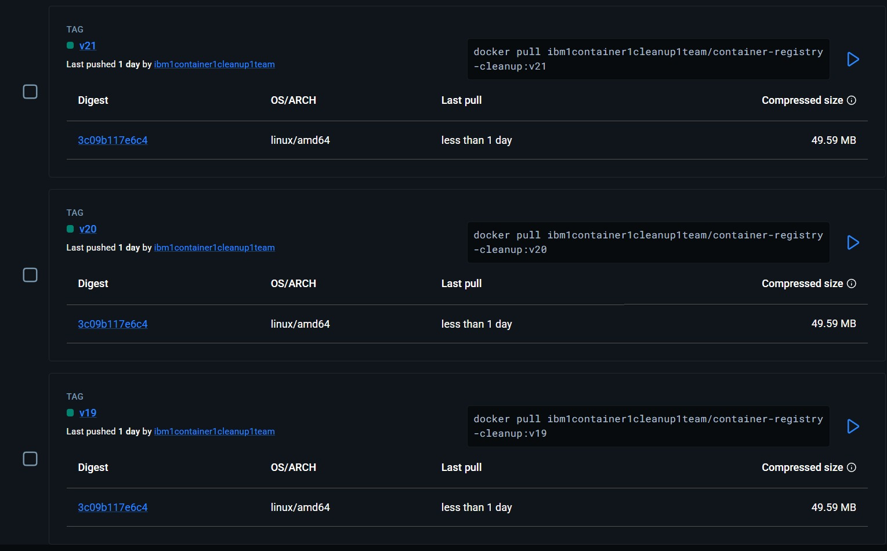

---

## Docker Image Push

Tagged Docker images were pushed to Docker Hub.

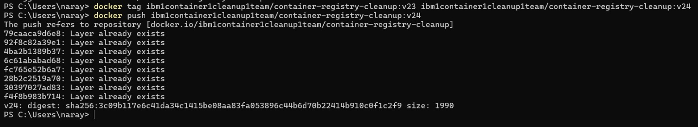

---

## Local Docker Images

Multiple image versions available locally.

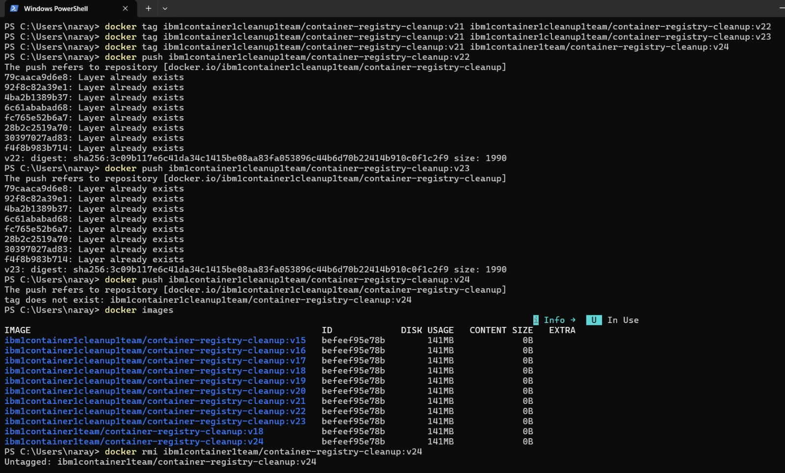

---

## Docker Hub Updated Tags

Published Docker image versions on Docker Hub.

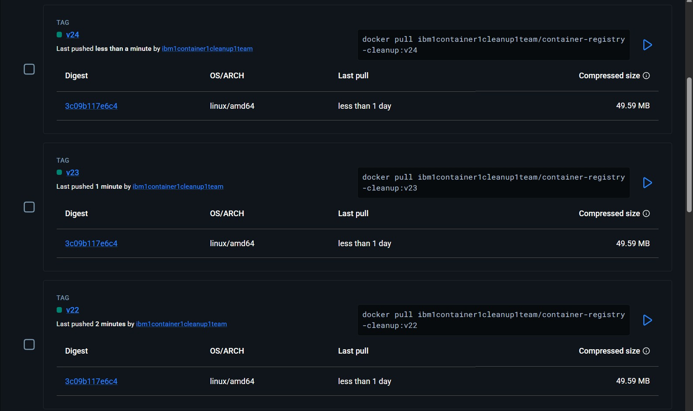

---

# 🔄 Cleanup Process

The cleanup script performs the following steps:

1. Authenticate to Docker Hub.
2. Retrieve repository image tags.
3. Analyze image versions.
4. Apply cleanup policy.
5. Identify removable tags.
6. Generate cleanup report.
7. Upload report as GitHub Actions artifact.

---

# 🔐 Security

Sensitive credentials are securely stored using GitHub Secrets.

Configured Secrets:

- DOCKER_USERNAME
- DOCKER_PASSWORD

No credentials are stored inside the source code.

---

# 📸 Project Screenshots

## 1. Project Structure

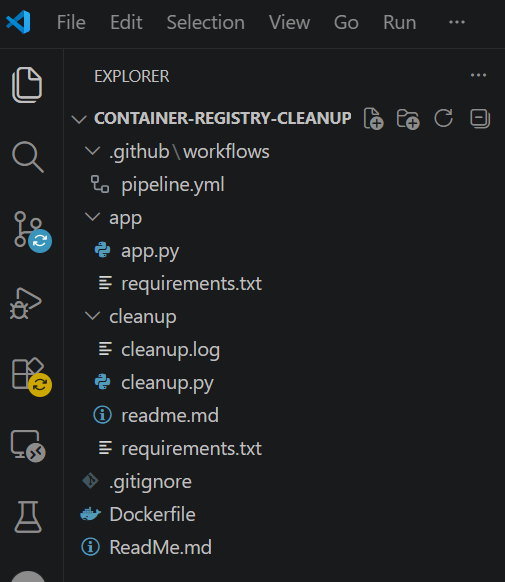

---

## 2. GitHub Repository

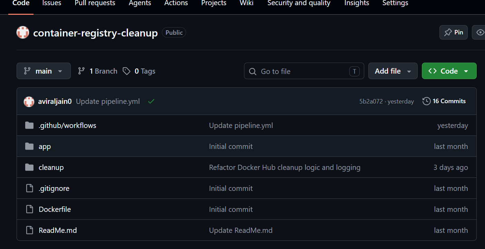

---

## 3. GitHub Actions Workflow

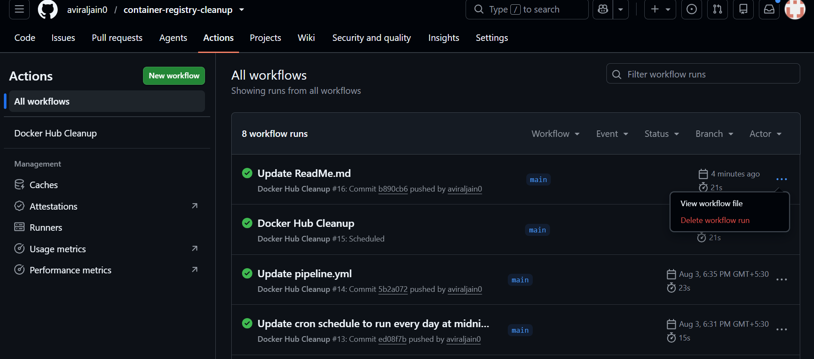

---

## 4. Successful Workflow Execution

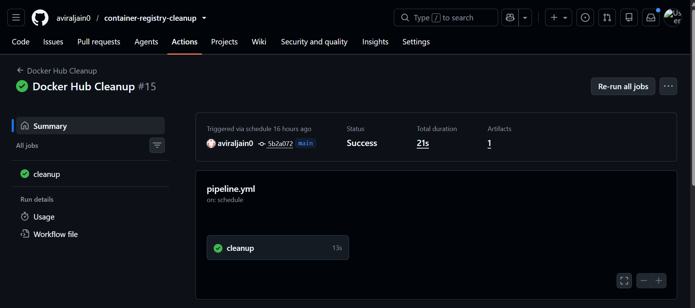

---

## 5. GitHub Secrets

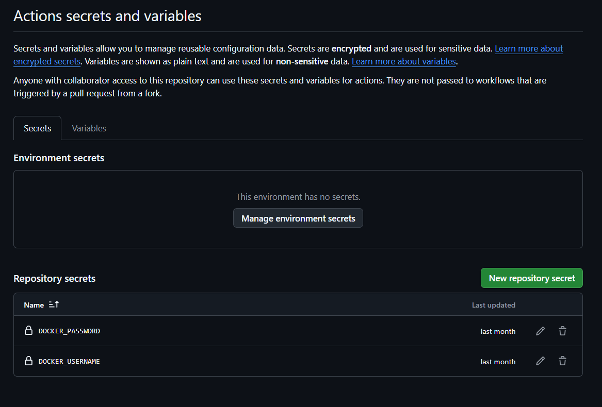

---

## 6. Docker Hub Repository

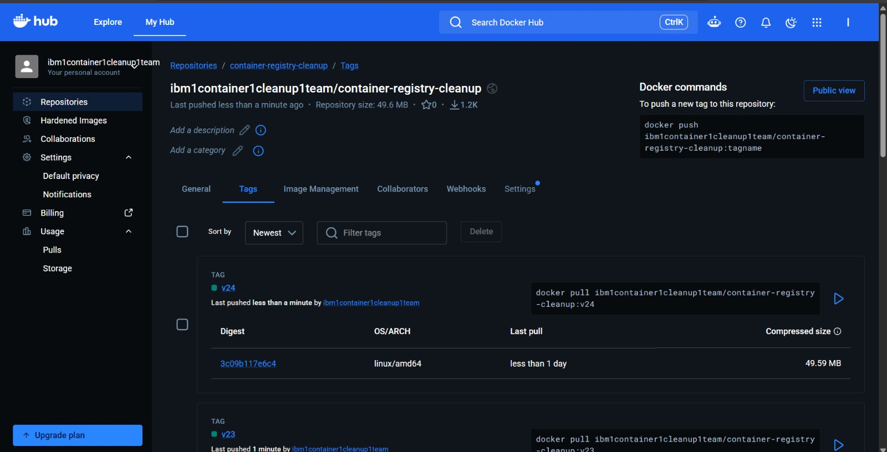

---

## 7. Docker Hub Tags


---

## 8. Python Cleanup Script Output

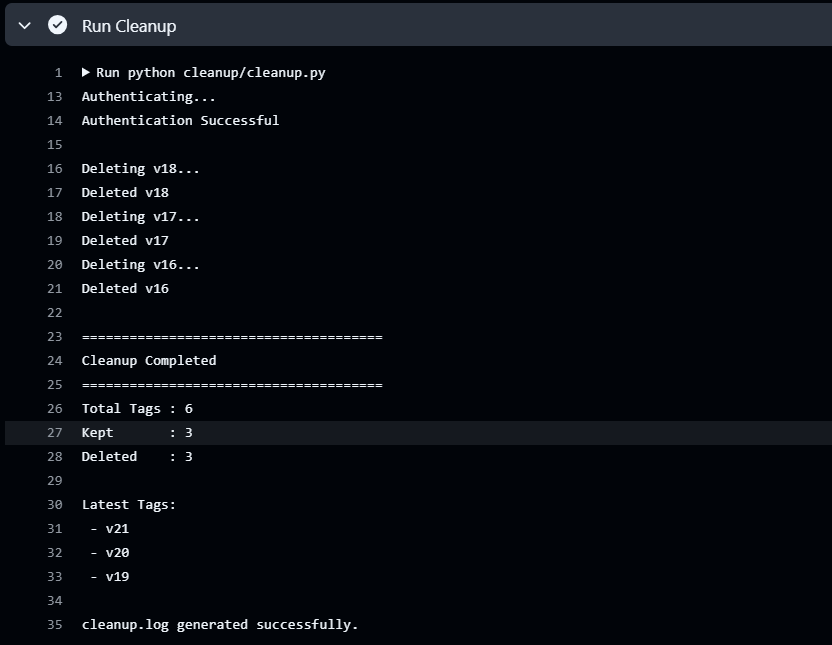

---

## 9. Cleanup Log

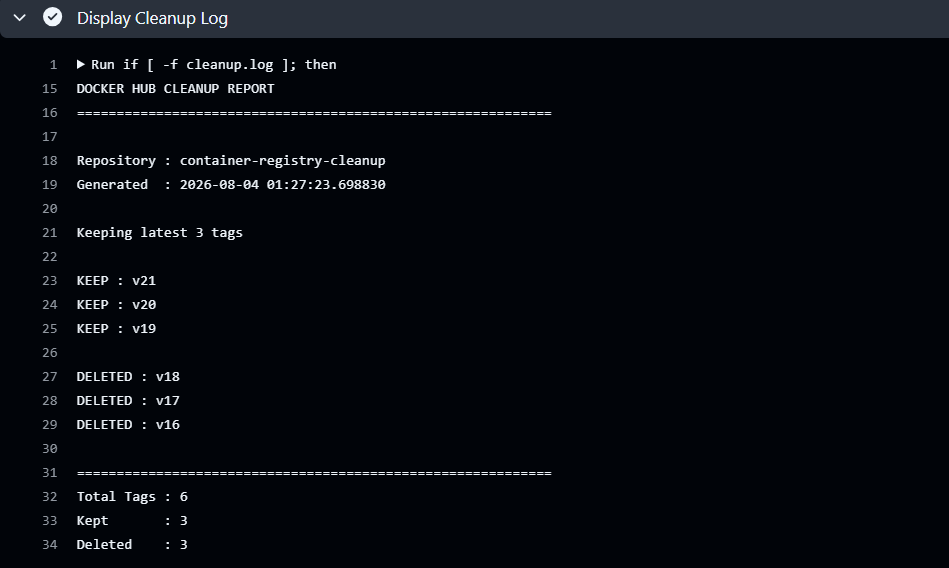

---

## 10. Workflow Logs

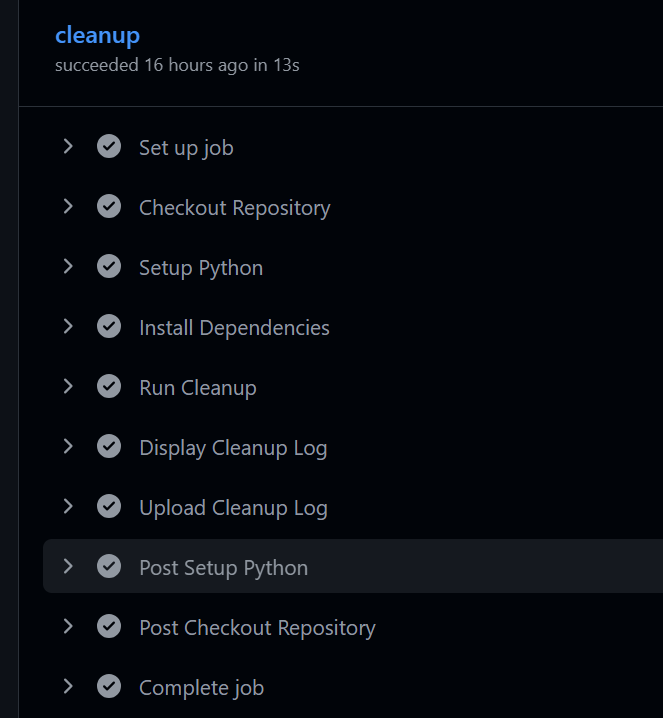

---

# ▶ Running the Project

## Clone Repository

```bash
git clone https://github.com/aviraljain0/container-registry-cleanup.git
```

---

## Navigate

```bash
cd container-registry-cleanup
```

---

## Install Dependencies

```bash
pip install -r cleanup/requirements.txt
```

---

## Configure Environment Variables

```
DOCKER_USERNAME=<your_dockerhub_username>

DOCKER_PASSWORD=<your_dockerhub_password>
```

---

## Execute Cleanup Script

```bash
python cleanup/cleanup.py
```

---

# 🚀 GitHub Actions

The workflow can be triggered using:

- Push to main branch
- Manual Execution (workflow_dispatch)
- Scheduled Execution (Daily/Weekly based on configuration)

---

# 📄 Cleanup Report

After execution, the project generates:

```
cleanup.log
```

The report contains:

- Repository Information
- Image Tags
- Cleanup Decision
- Summary
- Cleanup Statistics

The report is automatically uploaded as a GitHub Actions Artifact.

---

# 📊 Expected Output

The cleanup script provides:

- Authentication Status
- Repository Scan
- Retrieved Tags
- Cleanup Summary
- Generated Report

---

# 👥 Team Members

| Team Member | Responsibility |
|-------------|----------------|
| Member 1 | Project Planning & Requirement Analysis |
| Member 2 | Docker Hub Integration |
| Member 3 | Python Cleanup Script Development |
| Member 4 | GitHub Actions CI/CD Pipeline & Testing |

> Replace the member names with the actual names from your project report.

---

# 📈 Future Enhancements

- Automatic Email Notifications
- Slack Integration
- Multi-Repository Cleanup
- Dashboard Visualization
- Configurable Cleanup Policies
- Administrator Approval Before Deletion
- Docker Hub Webhook Integration

---

# 🏆 Project Outcome

The project successfully demonstrates:

- Docker Hub API Integration
- Python Automation
- GitHub Actions CI/CD
- Secure Secret Management
- Automated Cleanup Reporting
- Container Registry Maintenance

---

# 📚 Learning Outcomes

Through this project, the team gained experience in:

- Docker Hub Management
- REST API Integration
- Python Automation
- GitHub Actions
- CI/CD Pipeline Design
- Secure Credential Handling
- DevOps Best Practices

---

# 🙏 Acknowledgements

- IBM SkillsBuild
- GitHub
- Docker Hub
- Python Community
- Open Source Community

---

# 📧 Repository

GitHub Repository:

https://github.com/aviraljain0/container-registry-cleanup

---
